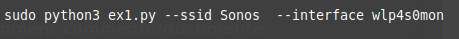
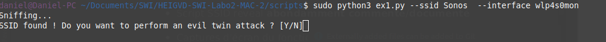
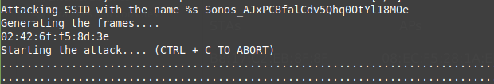
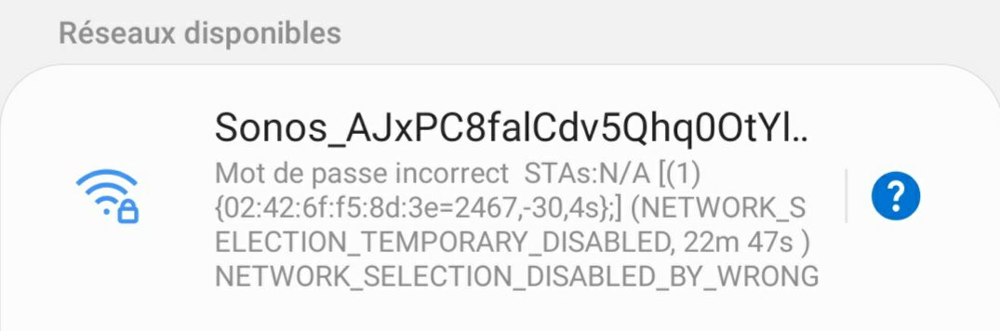

# SWI - Laboratoire 2 - 802.11 MAC 2

## Auteurs: Edin Mujkanovic et Daniel Oliveira Paiva

### 1. Probe Request Evil Twin Attack

#### 1.1 Questions

**Question** : comment ça se fait que ces trames puissent être lues par tout le monde ? Ne serait-il pas plus judicieux de les chiffrer ? 

Les probes request sont le correspondant des beacons pour les STA. En effet, ces trames permettent de demander si les AP déjà enregistré se trouvent à proximité et de s'annoncer directement auprès d'eux. Ces trames étant avant la phase d'authentification et d'association, aucun chiffrement préalable n'est possible. 

Les clés permettant le chiffrement s'effectuant pendant la phase d'association et changeant à chaque nouvelle connexion ou déconnexion, il est impossible de chiffrer ces trames.

**Question** : pourquoi les dispositifs iOS et Android récents ne peuvent-ils plus être tracés avec cette méthode ?

Les dispositifs récents iOS et Android randomisent leurs MAC adresses avant la connexion avec un AP pour éviter d'être tracées. 

#### 1.2 Fonctionnement du script

Le script prend deux paramètres : l'interface sur laquelle sniffer et le string du SSID à détecter pendant le sniffing. 

Lorsqu'une probe request du réseau a été trouvée, le script va demander à l'utilisateur s'il souhaite continuer et effectuer une evil twin attack.

Le script va ensuite afficher le SSID qui va être attaqué et l'adresse MAC de l'evil twin. Pour finir, l'attaque sera lancé.

À l'aide de mon téléphone, on peut s'apercevoir que le wifi est correctement généré avec l'adresse MAC précédemment affichée.

### 2. Détection de clients et réseaux

#### 2.1 Fonctionnement du script

### 3. Hidden SSID reveal

#### 3.1 Questions

**Question** : expliquer en quelques mots la solution que vous avez trouvée pour ce problème ?

#### 3.2 Fonctionnement du script