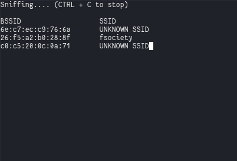

# SWI - Laboratoire 2 - 802.11 MAC 2

## Auteurs: Edin Mujkanovic et Daniel Oliveira Paiva

### 1. Probe Request Evil Twin Attack

#### 1.1 Questions

**Question** : comment ça se fait que ces trames puissent être lues par tout le monde ? Ne serait-il pas plus judicieux de les chiffrer ? 

Les probes request sont le correspondant des beacons pour les STA. En effet, ces trames permettent de demander si les AP déjà enregistré se trouvent à proximité et de s'annoncer directement auprès d'eux. Ces trames étant avant la phase d'authentification et d'association, aucun chiffrement préalable n'est possible. 

Les clés permettant le chiffrement s'effectuant pendant la phase d'association et changeant à chaque nouvelle connexion ou déconnexion, il est impossible de chiffrer ces trames.

**Question** : pourquoi les dispositifs iOS et Android récents ne peuvent-ils plus être tracés avec cette méthode ?

Les dispositifs récents iOs et Android randomisent leurs MAC adresses avant la connexion avec un AP pour éviter d'être tracés. 

#### 1.2 Fonctionnement du script

### 2. Détection de clients et réseaux

#### 2.1 Fonctionnement du script 2a

Il suffit de lancer le script en spécifiant l'interface et le SSID ciblé. En suite, le script va ensuite écouter tous les probes requests ciblant ce SSID et va lister les adresses MAC des clients qui les ont émises.

#### 2.2 Fonctionnement du script 2b

Il suffit de lancer le script en spécifiant l'interface et le temps souhaité pour le sniff. Le script va écouter toutes les trames DATA et repertorier les AP et les STAs correspondantes. Après avoir sniffer, il va afficher les résultats.

### 3. Hidden SSID reveal

#### 3.1 Questions

**Question** : expliquer en quelques mots la solution que vous avez trouvée pour ce problème ?

Notre solution fonctionne en deux temps:

- En premier, lors du scan, si on capte des *Beacon* de réseau wifis cachés, on stocke le BSSID dans un tableau. 
- Si on capte un probe response d'un des wifis dont le BSSID est dans le tableau, on stocke lit le nom et le stocke dans le tableau en le faisant correspondre au BSSID.

#### 3.2 Fonctionnement du script

On lance le script en spécifiant l'interface avec la commande : 

`sudo python ex3.py --interface wlan1mon`

Ensuite, les réseaux ayant un SSID caché seront listés. Il faut laissé le script tourner jusqu'à ce que un client se connecte à un de ces derniers afin de dévoiler le nom (ici, `fsociety`):

