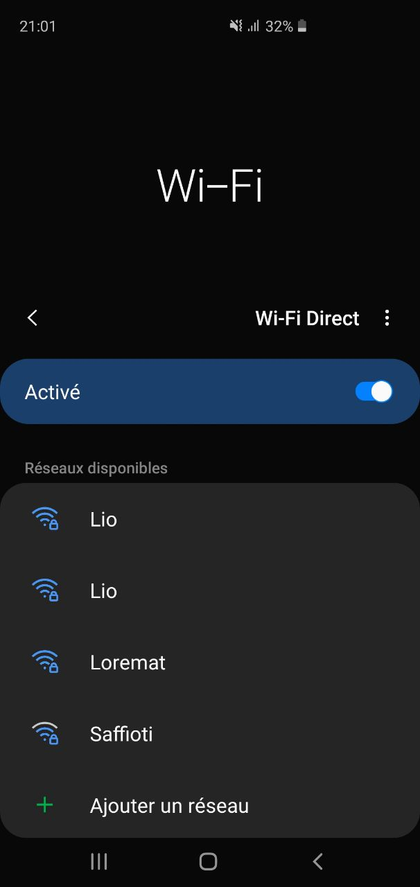

# Sécurité des réseaux sans fil

## Laboratoire 802.11 MAC 2

### 1. Probe Request Evil Twin Attack

Nous allons nous intéresser dans cet exercice à la création d'un evil twin pour viser une cible que l'on découvre dynamiquement utilisant des probes.

Développer un script en Python/Scapy capable de detecter une STA cherchant un SSID particulier - proposer un evil twin si le SSID est trouvé (i.e. McDonalds, Starbucks, etc.).

Pour la détection du SSID, vous devez utiliser Scapy. Pour proposer un evil twin, vous pouvez récupérer votre code du labo 1 ou vous servir d'un outil existant.

Le script est disponible dans le dossier `scripts/SWI-Lab-02-Prob-Request-Evil-Tween-Attack.py`

L'utilisation est la suivante:

```bash
python3 SWI-Lab-02-Prob-Request-Evil-Tween-Attack.py -s Lio
In progress...
You are going to attack : Lio
...............................................
```

On constate que sur l'image suivante que l'AP Lio existe, maintenant, bien en deux exemplaires : 




__Question__ : comment ça se fait que ces trames puissent être lues par tout le monde ? Ne serait-il pas plus judicieux de les chiffrer ?

Les informations contenues dans ces trames doivent être en clair, car pour que la STA et l'AP puissent s'appareiller, il faut échanger quelques paramètres avant de pouvoir chiffrer les communications. 

__Question__ : pourquoi les dispositifs iOS et Android récents ne peuvent-ils plus être tracés avec cette méthode ?

Une nouvelle technique permet de "randomniser"  l'adresse MAC et donc il n'est plus possible de les tracer.

soucre : https://connect.ed-diamond.com/MISC/MISC-096/MAC-Address-Randomization-tour-d-horizon


### 2. Détection de clients et réseaux

a) Développer un script en Python/Scapy capable de lister toutes les STA qui cherchent activement un SSID donné

Le script est disponible dans le dossier `scripts/SWI-Lab-02-Detect-Clients.py`.

L'utilisation est la suivante:

```
root@kali:/home/kali/Desktop# python3 SWI-Lab-02-Detect-Clients.py --help
usage: SWI-Lab-02-Detect-Clients.py [-h] [-i IFACE] -S SSID

SWI-Lab-02-Detect-Clients

optional arguments:
  -h, --help            show this help message and exit
  -i IFACE, --iface IFACE
                        Interface used for the attack.
  -S SSID, --SSID SSID  SSID for which are sniffing probe request.
```

Ci-dessous un exemple d'utilisation avec le SSID `iPhone` :

```
root@kali:/home/kali/Desktop# python3 SWI-Lab-02-Detect-Clients.py --SSID iPhone
Searching for devices sending probe request for SSID iPhone
Found a new device! MAC is 6a:12:f3:6e:ca:a8
Found a new device! MAC is b6:e8:2c:15:62:9b
Found a new device! MAC is f2:10:62:e8:6f:b5
Found a new device! MAC is 7a:4c:4a:59:0e:b5
Found a new device! MAC is b6:e8:b6:72:a4:8c
Found a new device! MAC is 32:72:d0:cb:48:c9
Found a new device! MAC is da:b6:3f:0d:d9:d9
Found a new device! MAC is c2:fe:e4:67:2a:d2
Found a new device! MAC is be:9c:f7:db:a4:5b
Found a new device! MAC is fa:89:6a:5d:18:46
Found a new device! MAC is 0e:ec:c3:e9:41:e6
Found a new device! MAC is ba:e6:4f:4d:dd:bf
...
```

Il s'agit à chaque fois d'une périphérique Android qui utilise des adresses MAC aléatoires pour ses Probe-Request.

b) Développer un script en Python/Scapy capable de générer une liste d'AP visibles dans la salle et de STA détectés et déterminer quelle STA est associée à quel AP. Par exemple :

Le script est disponible dans le dossier `scripts/SWI-Lab-02-Detect-Clients+APs.py`.

L'utilisation est la suivante:

```
root@kali:/home/kali/Desktop# python3 SWI-Lab-02-Detect-Clients+APs.py --help
usage: SWI-Lab-02-Detect-Clients+APs.py [-h] [-i IFACE]

SWI-Lab-02-Detect-Clients+APs

optional arguments:
  -h, --help            show this help message and exit
  -i IFACE, --iface IFACE
                        Interface used for the attack.

```

Exemple d'une utilisation de notre script:

```
root@kali:/home/kali/Desktop# python3 SWI-Lab-02-Detect-Clients+APs.py 
Searching for APs and connected STA
New access point found with MAC address e8:d1:1b:98:dc:90
New access point found with MAC address 38:35:fb:38:c0:8c
STA 33:33:00:00:00:01 is connected to AP e8:d1:1b:98:dc:90
STA 33:33:00:00:00:01 is connected to AP e8:d1:1b:98:dc:90
STA 33:33:00:00:00:01 is connected to AP e8:d1:1b:98:dc:90
STA 33:33:00:00:00:01 is connected to AP e8:d1:1b:98:dc:90
STA 33:33:00:00:00:01 is connected to AP e8:d1:1b:98:dc:90
STA 33:33:00:00:00:01 is connected to AP e8:d1:1b:98:dc:90
STA 01:00:5e:00:00:16 is connected to AP e8:d1:1b:98:dc:90
STA 01:00:5e:00:00:16 is connected to AP e8:d1:1b:98:dc:90
STA 01:00:5e:00:00:fb is connected to AP e8:d1:1b:98:dc:90
STA 01:00:5e:00:00:fc is connected to AP e8:d1:1b:98:dc:90
STA 01:00:5e:00:00:fb is connected to AP e8:d1:1b:98:dc:90
STA 01:00:5e:7f:ff:fa is connected to AP e8:d1:1b:98:dc:90
```

### 3. Hidden SSID reveal

Développer un script en Python/Scapy capable de reveler le SSID correspondant à un réseau configuré comme étant "invisible".

Le script est disponible dans le dossier `scripts/SWI-Lab-02-Hidden-SSID-Reveal`.

L'utilisation est la suivante:

```bash
root@kali:~/PycharmProjects/SWI_Labo1# python SWI-Lab-02-Hidden-SSID-Reveal.py 
In progress...
```

Nous n'avons pas tester le script par manque de matériel, je n'ai que le partage de connexion de mon smartphone pour avoir une connexion internet et non un vrai routeur pour y créer un réseau caché. 

__Question__ : expliquer en quelques mots la solution que vous avez trouvée pour ce problème ?

On scane d'abord les beacon frames, on regarde si il y a un SSID null, si oui, on ajoute son addresse MAC à un set pour ensuite tester les paquets contenant des probes responses. De ce fait, si l'une des probes responses à une adresse mac contenu dans le set, on peut récupérer le nom de l'AP. Il faut, pour cela, qu'un appreille se connecte au réseau "invisible".

## Livrables

Un fork du repo original . Puis, un Pull Request contenant :

- Script evil twin __abondamment commenté/documenté__

- Scripts détection STA et AP __abondamment commenté/documenté__

- Script SSID reveal __abondamment commenté/documenté__

- Captures d'écran du fonctionnement de chaque script

-	Réponses aux éventuelles questions posées dans la donnée. Vous répondez aux questions dans votre ```README.md``` ou dans un pdf séparé

-	Envoyer le hash du commit et votre username GitHub par email au professeur et à l'assistant


## Échéance

Le 16 mars 2020 à 23h59
