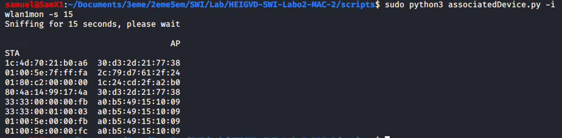

[Livrables](#livrables)

[Échéance](#échéance)

[Introduction](#introduction)

[Travail à réaliser](#travail-à-réaliser)

- [Sécurité des réseaux sans fil](#s%c3%a9curit%c3%a9-des-r%c3%a9seaux-sans-fil)
  - [Laboratoire 802.11 MAC 2](#laboratoire-80211-mac-2)
  - [Introduction](#introduction)
  - [Travail à réaliser](#travail-%c3%a0-r%c3%a9aliser)
    - [1. Probe Request Evil Twin Attack](#1-probe-request-evil-twin-attack)
    - [2. Détection de clients et réseaux](#2-d%c3%a9tection-de-clients-et-r%c3%a9seaux)
    - [3. Hidden SSID reveal](#3-hidden-ssid-reveal)
  - [Livrables](#livrables)
  - [Échéance](#%c3%89ch%c3%a9ance)

# Sécurité des réseaux sans fil

## Laboratoire 802.11 MAC 2

__A faire en équipes de deux personnes__

## Introduction

L’une des informations de plus intéressantes et utiles que l’on peut obtenir à partir d’un client sans fils de manière entièrement passive (et en clair) se trouve dans la trame ``Probe Request`` :


Dans ce type de trame, utilisée par les clients pour la recherche active de réseaux, on peut retrouver :

* L’adresse physique (MAC) du client (sauf pour dispositifs iOS 8 ou plus récents et des versions plus récentes d'Android).
	* Utilisant l’adresse physique, on peut faire une hypothèse sur le constructeur du dispositif sans fils utilisé par la cible.
	* Elle peut aussi être utilisée pour identifier la présence de ce même dispositif à des différents endroits géographiques où l’on fait des captures, même si le client ne se connecte pas à un réseau sans fils.
* Des noms de réseaux (SSID) recherchés par le client.
	* Un Probe Request peut être utilisé pour « tracer » les pas d’un client. Si une trame Probe Request annonce le nom du réseau d’un hôtel en particulier, par exemple, ceci est une bonne indication que le client s’est déjà connecté au dit réseau.
	* Un Probe Request peut être utilisé pour proposer un réseau « evil twin » à la cible.

Il peut être utile, pour des raisons entièrement légitimes et justifiables, de détecter si certains utilisateurs se trouvent dans les parages. Pensez, par exemple, au cas d'un incendie dans un bâtiment. On pourrait dresser une liste des dispositifs et la contraster avec les personnes qui ont déjà quitté le lieu.

A des fins plus discutables du point de vue éthique, la détection de client s'utilise également pour la recherche de marketing. Aux Etats Unis, par exemple, on "sniff" dans les couloirs de centres commerciaux pour détecter quelles vitrines attirent plus de visiteurs, et quelle marque de téléphone ils utilisent. Ce service, interconnecté en réseau, peut aussi déterminer si un client visite plusieurs centres commerciaux un même jour ou sur un certain intervalle de temps.

## Travail à réaliser

### 1. Probe Request Evil Twin Attack

Nous allons nous intéresser dans cet exercice à la création d'un evil twin pour viser une cible que l'on découvre dynamiquement utilisant des probes.

Développer un script en Python/Scapy capable de detecter une STA cherchant un SSID particulier - proposer un evil twin si le SSID est trouvé (i.e. McDonalds, Starbucks, etc.).

Pour la détection du SSID, vous devez utiliser Scapy. Pour proposer un evil twin, vous pouvez récupérer votre code du labo 1 ou vous servir d'un outil existant.

(Sources eviltwin: https://thecybersecurityman.com/2018/08/11/pentest-edition-creating-an-evil-twin-or-fake-access-point-using-aircrack-ng-and-dnsmasq-part-1-setup/)
(Sources sniff SSID: https://gist.github.com/securitytube/5291959)


On peut voir que le channel est différent entre les deux trames quand on passe comme argument le wifi Palace :  
  `sudo python3 probeRequestEvilTwin.py -i wlan1mon -s 15 -SSID Palace`


__Question__ : comment ça se fait que ces trames puissent être lues par tout le monde ? Ne serait-il pas plus judicieux de les chiffrer ?

Cela ne peut pas être chiffré car justement c'est avant l'établissement de la communication et donc avant l'échange de clef.

__Question__ : pourquoi les dispositifs iOS et Android récents ne peuvent-ils plus être tracés avec cette méthode ?

Depuis récemment, les addresses MAC des appareils iOS et Android sont aléatoires pendant le scanning passive de wifi. Cela veut dire que l'on ne peut plus nous tracker.

### 2. Détection de clients et réseaux

a) Développer un script en Python/Scapy capable de lister toutes les STA qui cherchent activement un SSID donné


On peut voir ici que l'on cherchait le wifi Palace, wifi sur lequel je me suis connecté avec mon téléphone pendant le laps de temps de 15 secondes.

b) Développer un script en Python/Scapy capable de générer une liste d'AP visibles dans la salle et de STA détectés et déterminer quelle STA est associée à quel AP. Par exemple :

STAs &nbsp; &nbsp; &nbsp; &nbsp; &nbsp; &nbsp; &nbsp; &nbsp; &nbsp; &nbsp; &nbsp; &nbsp; &nbsp; &nbsp; &nbsp; &nbsp; &nbsp; &nbsp; &nbsp; APs

B8:17:C2:EB:8F:8F &nbsp; &nbsp; &nbsp; &nbsp; &nbsp; &nbsp; 08:EC:F5:28:1A:EF

9C:F3:87:34:3C:CB &nbsp; &nbsp; &nbsp; &nbsp; &nbsp; &nbsp; 00:6B:F1:50:48:3A

00:0E:35:C8:B8:66 &nbsp; &nbsp; &nbsp; &nbsp; &nbsp; &nbsp; 08:EC:F5:28:1A:EF

On peut voir tous les sta et ap qui communique : 

 

### 3. Hidden SSID reveal

Développer un script en Python/Scapy capable de reveler le SSID correspondant à un réseau configuré comme étant "invisible".

__Question__ : expliquer en quelques mots la solution que vous avez trouvée pour ce problème ?

__Réponse__ : Grâce aux mesures que nous avons effectuées, nous avons pu constater que les AP qui "cachent" leur ESSID continuent d'envoyer des beacons. La seule différence est qu'ils remplacent leur nom de wifi (ESSID) par une chaine de caractères de bytes null ('\x00'). Notre solution consite à :
- Récupérer les beacons monitorés, parser le champs ESSID et contrôler s'il ne contient que des bytes null. Si c'est le cas, cela veut dire que nous avons à faire à un wifi "caché" et nous stockons ses données dans un dataframe.

- Monitorer les *probes response* qui contiennent le ESSID. Si le BSSID correspondant se trouve dans notre dataframe, alors nous affichons le BSSID, ESSID ainsi que la force du signal de ce réseau caché.

Note : Avec notre solution, il est obligatoire d'attendre qu'un client se connecte au wifi caché afin de pouvoir réccupérer le ESSID. Une autre solution serait de forcer ce processus en envoyant une trame de deauthentification sur un client connecté afin de tenter de récupérer un *probe response* de l'AP lors de la reconnexion au wifi.

On peut voir sur le screen que la première fois personne ne s'est connecté sur le wifi caché. La deuxième fois, un utilisateur se connecte et on peut l'apercevoir : Palace1.


## Livrables

Un fork du repo original . Puis, un Pull Request contenant :

- Script evil twin __abondamment commenté/documenté__

- Scripts détection STA et AP __abondamment commenté/documenté__

- Script SSID reveal __abondamment commenté/documenté__

- Captures d'écran du fonctionnement de chaque script

-	Réponses aux éventuelles questions posées dans la donnée. Vous répondez aux questions dans votre ```README.md``` ou dans un pdf séparé

-	Envoyer le hash du commit et votre username GitHub par email au professeur et à l'assistant


## Échéance

Le 16 mars 2020 à 23h59
