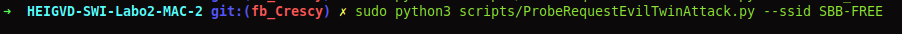

# Sécurité des réseaux sans fil
> Laboratoire: Labo2-MAC-2   
> Étudiants: Yimnaing Crescence, Siu Aurélien

### 1. Probe Request Evil Twin Attack

**Question : comment ça se fait que ces trames puissent être lues par tout le monde ? Ne serait-il pas plus judicieux de les chiffrer ?**

 Elles sont lues par tout le monde car elles ne sont pas chiffrées. Ces probes request sont envoyées par les clients pour trouver un réseau Wifi sur lequel se connecter. Comme elles ne sont pas encore connectée à un point d'accès, le chiffrement ne peut encore être établi à ce stade. 

**Question : pourquoi les dispositifs iOS et Android récents ne peuvent-ils plus être tracés avec cette méthode ?**

Car l'adresse MAC de ces périphériques est randomisée afin de les protéger.

> Chemin du script : HEIGVD-SWI-Labo2-MAC-2/scripts/ProbeRequestEvilTwinAttack.py

#### Utilisation du script:
Le script n'a malheureusement pas été testé par manque de temps.

  

### 2. Détection de clients et réseaux

a) Développer un script en Python/Scapy capable de lister toutes les STA qui cherchent activement un SSID donné

> Chemin du script :
HEIGVD-SWI-Labo2-MAC-2/scripts/DetectClientSearchingSSID.py

#### Preuve de fonctionnement du script:

b) Développer un script en Python/Scapy capable de générer une liste d'AP visibles dans la salle et de STA détectés et déterminer quelle STA est associée à quel AP. Par exemple 
> Chemin du script :
HEIGVD-SWI-Labo2-MAC-2/scripts/DetectNetworkAP.py

#### Preuve de fonctionnement du script:

### 3. Hidden SSID reveal

__Question__ : expliquer en quelques mots la solution que vous avez trouvée pour ce problème ?

Nous récupérons dans un premier la liste des adresses MAC des APs ayant un SSID null. Le SSID se trouvant dans la Probe Response lorsque qu'un client se connecte à ce même réseau, nous pouvons le récupérer.

> Chemin du script : HEIGVD-SWI-Labo2-MAC-2/Scripts/UncoveredHiddenSSID.py

#### Preuve de fonctionnement du script:

